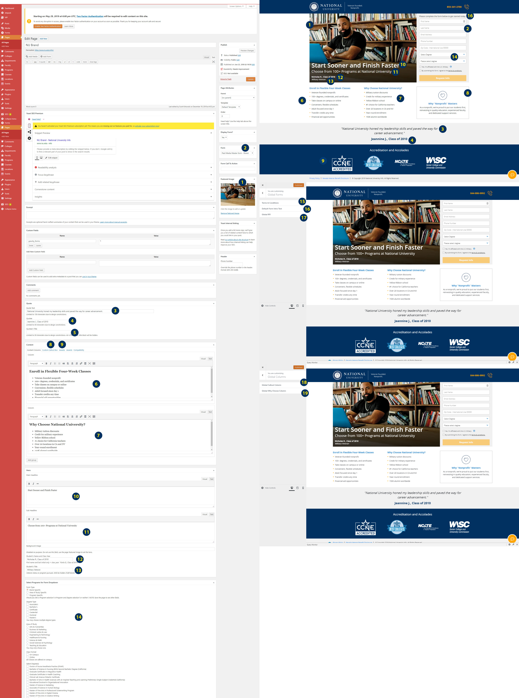

# NUS WP Info Theme
<!-- ALL-CONTRIBUTORS-BADGE:START - Do not remove or modify this section --><!-- ALL-CONTRIBUTORS-BADGE:END -->

## Overview
This WordPress theme was created so that all of the National University affiliate info websites would have a standardized codebase to work with.

When building a new info site for an affiliate, the first step is to make a **child theme** of the `info-theme` theme.

This will let you use the power of the full theme, while allowing customization where needed.

For information on how to setup this theme with node and gulp, see [here](https://github.com/NationalUniversitySystem/nusa-base-wptheme).

---

## Features:
- Gulp setup
- `src` folder is where your SASS/SCSS and JS file development should occur
- `assets` folder and it's contents are generated by the gulp setup
- Override the project URL by creating a file in the root of the theme `gulp.config.local.js` with an object containing your local `projectURL`

---

## Must includes:
- Gulp file setup
- Basic theme setup in `./inc/class-nusa-theme-setup`
- ESLint and stylelint rules are based on our team and industry standards, do not change these.

---

## Can be removed/deleted or changed:
- Widgets setup inside the theme. The files present are here as an example.
- Customizer setup. The project might not call for it, but again the files are here as example.

---

## Things you might think are missing but are not:
- **Image optimization in Gulp**: This should be done manually because you do not always want to apply the exact same optimization to all images. Refer to [our dev tools](https://github.com/NationalUniversitySystem/nusa-dev-tools#image-compression) for options.

---

## Legend
The below numbers correspond to the [Numbered Map](Info-Theme-Numbered-Guide.jpg), explaining what content in the admin changes what on the front end. While we tried to account for as much as possible, each affiliate’s info site will ultimately have its own unique requirements that may need to be added or removed as necessary. Please do not hesitate to ask if you have any questions.

1. Sets the hero image background URL.
2. Sets the gravity form that should display on the page.
3. Sets the Quote.
4. Sets the Quotee, or who said the quote.
5. Optional, some pages have an extra line such as “Student, Class of 2020”.
6. Content for the first column block.
7. Content for the second column block.
8. This will set custom content for the callout box. This column is normally the same throughout the site, and is set on a global level via #18 in the customizer.  If not custom, leave empty.
9. Set the awards, using the Media Library. Ignore “Awards - Compatibility”, this is for backwards compatibility on existing info sites.
10. The `<h1>` of the page, the main hero tagline. Wrap the content in a `` element to dictate where the text breaks on mobile resolutions. E.G: `This Line Will Be Separate From This Line On Mobile`.
11. The `<h2>` of the page, in the hero. The  rule applies here as well.
12. Student name in the hero.
13. Student title in the hero.
14. This determines what programs are to display on the form, as some forms only have specific programs available to them.This will be up to the developer, as there are a few options:
    1. ( Preferred Method ) Create custom post type of `program` with a taxonomy of `degree-type`.
        1. This will always update the dropdown field on the frontend and the choices in the admin when making changes to the CPT’s.
    2. Fill out the drop down once and save it as a “Save as new custom choice”.
        2. This will have to be manually updated each time.
15. Sets the global terms and conditions of the site.
16. Sets the default form intro text, e.g. “Please complete the form below to get started today.”
17. Sets the form that should display if no form is selected on a per-page basis.
18. Sets the default “Callout” column content.
19. Sets the global “Why Choose” column content.

## Contributors ✨
<!-- ALL-CONTRIBUTORS-LIST:START - Do not remove or modify this section -->
<!-- prettier-ignore-start -->
<!-- markdownlint-disable -->
<table>
  <tr>
    <td align="center"><a href="https://github.com/mestradanu"> <b>Mike Estrada</b></a> <a href="https://github.com/NationalUniversitySystem/info-theme/commits?author=mestradanu" title="Code">💻</a> <a href="#projectManagement-mestradanu" title="Project Management">📆</a> <a href="https://github.com/NationalUniversitySystem/info-theme/pulls?q=is%3Apr+reviewed-by%3Amestradanu" title="Reviewed Pull Requests">👀</a> <a href="#maintenance-mestradanu" title="Maintenance">🚧</a></td>
    <td align="center"><a href="https://github.com/agameronu"> <b>Alex Gamero</b></a> <a href="https://github.com/NationalUniversitySystem/info-theme/commits?author=agameronu" title="Code">💻</a> <a href="#tool-agameronu" title="Tools">🔧</a></td>
    <td align="center"><a href="https://github.com/cmaustnu"> <b>Chris Maust</b></a> <a href="https://github.com/NationalUniversitySystem/info-theme/commits?author=cmaustnu" title="Code">💻</a> <a href="#a11y-cmaustnu" title="Accessibility">️️️️♿️</a></td>
  </tr>
</table>

<!-- markdownlint-enable -->
<!-- prettier-ignore-end -->
<!-- ALL-CONTRIBUTORS-LIST:END -->

The [Emoji Key](https://allcontributors.org/docs/en/emoji-key) ✨ (and Contribution Types) can be found on [allcontributors.org](https://allcontributors.org)
